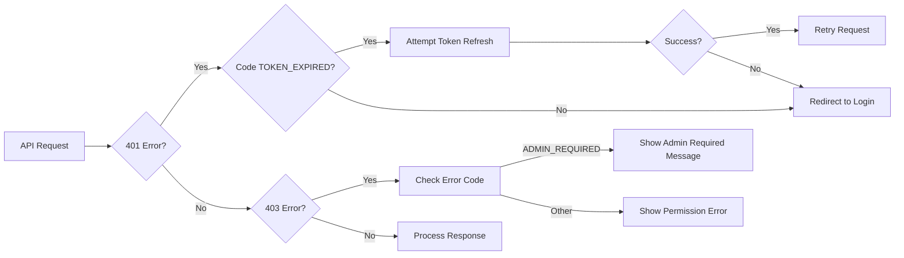

# Authentication System

## Token Requirements
- Required for all entry modification requests
- Must be provided in `Authorization: Bearer <token>` header
- Requires `entries:write` permission for editing entries

## Role-Based Permissions
| Operation | Required Role | Notes |
|-----------|---------------|-------|
| Patient Deletion | `admin` | Soft-deletes patient records and creates audit trail |
| Entry Modification | `user` or `admin` | |
| Patient Creation | `user` or `admin` | |

## Error Codes
| Code | Status | Description |
|------|--------|-------------|
| `MISSING_TOKEN` | 401 | Authorization header missing or invalid |
| `INVALID_TOKEN` | 401 | Token verification failed |
| `TOKEN_EXPIRED` | 401 | Token has expired |
| `INSUFFICIENT_PERMISSIONS` | 403 | Token lacks required permissions |
| `ADMIN_REQUIRED` | 403 | Admin role required for this operation |

## Client-Side Handling


## Testing
Run authentication tests:
```bash
cd server && npm test src/tests/authentication.test.ts
```

## Audit Trail
- Patient deletions are recorded in `patient_deletion_audit` table
- Includes: patient ID, deleted by user ID, timestamp, and reason