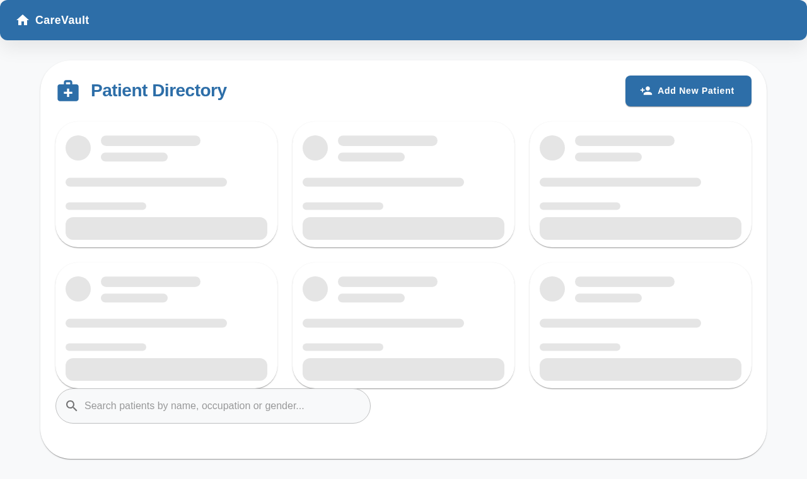

# CareVault - Patient Management System  

CareVault is a digital tool for clinics to efficiently manage patient information and track health metrics.  

  

## Features  

- Patient history tracking  
- Health rating visualization  
- Robust form validation  
- Error recovery system  
- Medical entry management  

## Setup Instructions  

### Prerequisites  

- Node.js v18+  
- npm v9+  
- Docker v20+ and Docker Compose v2+ (for Docker deployment)  

### Local Development Installation  

```bash  
# Clone repository  
git clone https://github.com/your-org/carevault.git  
cd carevault  

# Install client dependencies  
cd client && npm install  

# Install server dependencies  
cd ../server && npm install  
```  

### Running with Docker Compose  

```bash  
# Start all services (client, server)  
docker-compose up --build  

# Access application at:
# Client: http://localhost:5173
# Server API: http://localhost:3001/api
```  

### Running Locally Without Docker  

```bash  
# Start client development server  
cd client  
npm run dev  

# Start server (in separate terminal)  
cd ../server  
npm run dev  
```  

Visit `http://localhost:5173` to access the application.  

## Architecture Overview  

The application follows a client-server architecture with:  
- React frontend (Vite)  
- Node.js backend (Express)  
- Docker containers for deployment  

[View detailed architecture documentation](ARCHITECTURE.md)  

## API Documentation  

### Patients Endpoint  

`GET /api/patients`  
Returns list of patients  

**Example Response:**  

```json  
[
  {
    "id": "d2773336-f723-11e9-8f0b-362b9e155667",
    "name": "John McClane",
    "dateOfBirth": "1986-07-09",
    "ssn": "090786-122X",
    "gender": "male",
    "occupation": "New York cop",
    "entries": []
  }
]
```  

### Add Entry Endpoint  

`POST /api/patients/:id/entries`  
Adds new medical entry  

**Request Body:**  

```json  
{
  "type": "HealthCheck",
  "description": "Annual checkup",
  "date": "2025-06-06",
  "specialist": "Dr. House",
  "healthCheckRating": 0
}
```  

[View Full API Documentation](server/src/routes/patientsRoute.ts)  
## Authentication

All write operations require the `X-User-Id` header to be set. In production, this header must contain a valid user ID. During development, if the header is not provided, the server will use a mock user ID.

## Screenshots  

  
  
  

## Documentation

- [Component Documentation](client/docs/index.html)
- [API Documentation](server/docs/index.html)
- [System Architecture](ARCHITECTURE.md)
- [Contribution Guidelines](CONTRIBUTING.md)

## Contributing

Please read our [Contribution Guidelines](CONTRIBUTING.md) for details on our code standards and pull request process.
