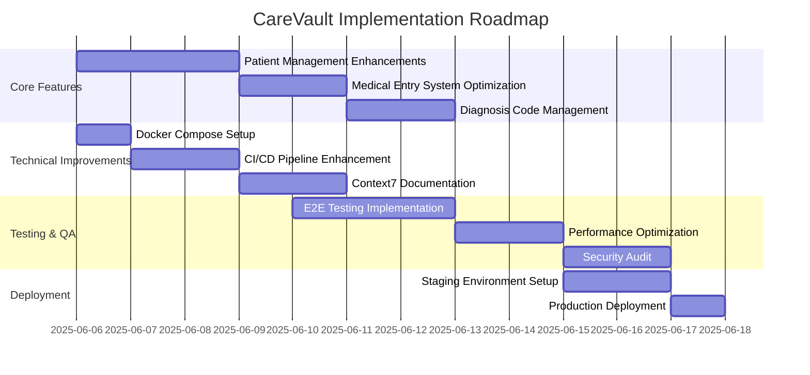

# CareVault Implementation Roadmap

## Key Requirements Summary

1. **Core Functionality**:
   - Patient management (CRUD operations)
   - Medical entry system (hospital, occupational, health check)
   - Diagnosis code management
   - Health rating visualization
   - Error boundary handling

2. **Technical Requirements**:
   - React/TypeScript frontend
   - Node/Express backend
   - Docker support
   - CI/CD pipeline
   - TDD approach

3. **Current Progress**:
   - Core functionality implemented (✓)
   - High test coverage (100% for key components ✓)
   - Documentation in place (✓)
   - CI/CD pipeline operational (✓)

### Implementation Roadmap

### Detailed Implementation Plan

1. **Patient Management Enhancements**:
   - Add search/filter capabilities to patient lists
   - Implement patient history timeline
   - Add patient photo upload feature

2. **Medical Entry System Optimization**:
   - Streamline entry creation workflow
   - Add templates for common entry types
   - Implement auto-save functionality

3. **Diagnosis Code Management**:
   - Integrate with ICD-10 API
   - Add diagnosis code search/validation
   - Create diagnosis frequency reports

4. **Docker Compose Setup**:
   - Create unified docker-compose.yml
   - Configure environment variables
   - Set up volume mapping for persistent data

5. **CI/CD Pipeline Enhancement**:
   - Add automated security scanning
   - Implement performance benchmarking
   - Set up staging deployment automation

6. **Context7 Documentation**:
   - Audit existing documentation
   - Add missing Context7 annotations
   - Generate documentation portal
